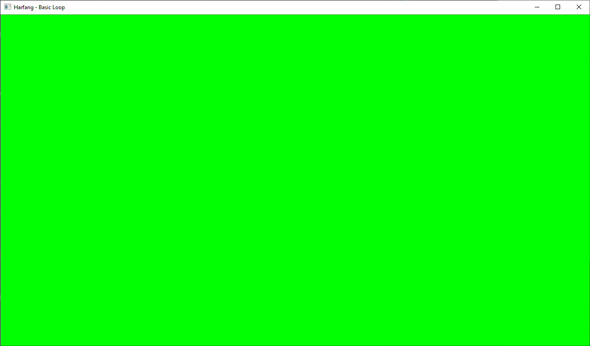
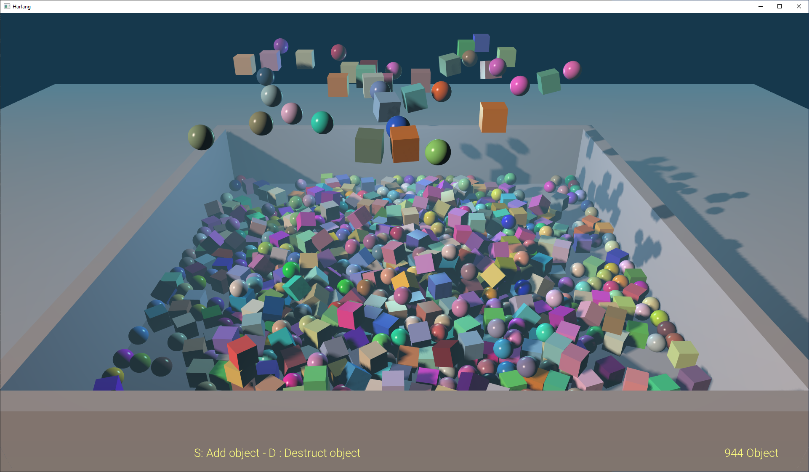
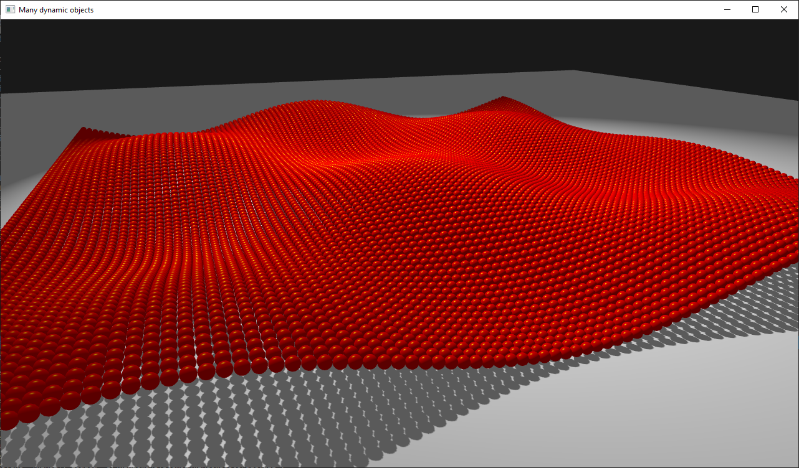

# HARFANG® 3.0 Tutorials

These **tutorials** demonstrate the usage of the HARFANG 3.0 C++ API.

To run the tutorials:

1. Download or clone this repository to your computer _(eg. in `d:/hg_cpp_tutorials`)_.
2. Download the _C++ SDK_ for your platform from [here](https://harfang3d.com/releases).
3. Download _assetc_ for your platform from [here](https://harfang3d.com/releases) to compile the tutorial resources.

**If you want to know more about HARFANG**, please visit the [official website](https://www.harfang3d.com).

## Build instructions
We will use CMake build system to compile both the C++ source code and resources of the tutorials.

First create a build directory.
```
mkdir build
cd build
```

We will now invoke CMake configuration.
```
cmake .. \
    -DHG_CPPSDK_PATH=<the directory where the Harfang C++ SDK was installed> \
    -DHG_ASSETC_PATH=<the directory where the assetc was installed> \
    -DCMAKE_INSTALL_PREFIX=<see below>
```
`CMAKE_INSTALL_PREFIX` is the directory where the tutorial executables, their dependencies and compiled resources will be copied.

You can also use CMake GUI to configure your project.

The tutorials can now be built using:
```
cmake --build . --targe install
```
Under Windows, when using MSVC, you can also pass the configuration
```
cmake --build . --config Release --targe install
```

## Screenshots
* Basic window
[](basic_loop.cpp)

* Physics pool of objects
[](physics_pool_of_objects.cpp)

* Scene with many nodes
[](scene_many_nodes.cpp)
